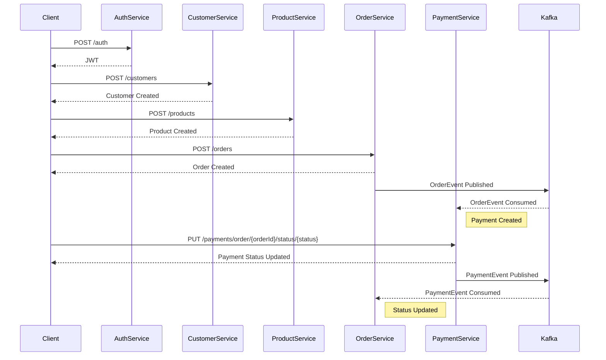

# [Microservices](https://github.com/rafaelfgx/Microservices)

**Clean Architecture, Event-Driven Architecture, Clean Code, SOLID Principles, Resilience, Idempotency, Folder-by-Feature, Patterns (Mediator, Result, Strategy, Outbox, Retry, Circuit Breaker), Java, Spring Boot, Kong, Keycloak, Kafka, MongoDB, Redis, Elastic, Kibana, Swagger, Docker.**

# [Architecture](https://github.com/rafaelfgx/Architecture)

**.NET 9, Angular 20, Clean Architecture, Clean Code, SOLID Principles, KISS Principle, DRY Principle, Fail Fast Principle, Common Closure Principle, Common Reuse Principle, Acyclic Dependencies Principle, Mediator Pattern, Result Pattern, Folder-by-Feature Structure, Separation of Concerns.**

# [DotNetCore](https://github.com/rafaelfgx/DotNetCore)

 **.NET 9 Nuget Packages**
 
 **⭐️🚀 7+ Million Downloads! 🚀⭐️**
 
 **https://www.nuget.org/profiles/rafaelfgx**

# [Java](https://github.com/rafaelfgx/Java)

**Java 24, Spring Boot 3, Docker, Testcontainers, PostgreSQL, MongoDB, Kafka, LocalStack, AWS (SQS, S3), JWT, Swagger, Patterns (Mediator, Observer, Outbox, Strategy).**

# [Node](https://github.com/rafaelfgx/Node)

**Node, Express, TypeScript, MongoDB, Jest, Joi, Testcontainers, ESLint, Prettier, Folder-by-Feature Structure.**

# [Nest](https://github.com/rafaelfgx/Nest)

**Nest, JWT Authentication and Authorization, Swagger, Folder-by-Feature Structure.**

# [Blockchain](https://github.com/rafaelfgx/Blockchain)

**Blockchain, Wallet, Smart Contracts, Token, NFT, SBT, Solidity.**

# Programming Paradigms

- [Object Oriented Programming](https://github.com/rafaelfgx/Utils/blob/main/root/ObjectOrientedProgramming.md)

- [Functional Programming](https://github.com/rafaelfgx/Utils/blob/main/root/FunctionalProgramming.md)

# Best Practices

- [SOLID](https://github.com/rafaelfgx/Utils/blob/main/root/SOLID.md)

- [Design Patterns](https://github.com/rafaelfgx/Utils/tree/main/root/DesignPatterns)

# Software Design

- [System Design](https://github.com/rafaelfgx/Utils/blob/main/root/SystemDesign.md)

- [Architecture](https://github.com/rafaelfgx/Utils/blob/main/root/Architecture.md)

- [DDD](https://github.com/rafaelfgx/Utils/blob/main/root/DDD.md)

# Distributed Systems

- [Distributed Computing](https://github.com/rafaelfgx/Utils/blob/main/root/DistributedComputing.md)

- [Docker](https://github.com/rafaelfgx/Utils/tree/main/root/Docker)

- [Kubernetes](https://github.com/rafaelfgx/Utils/tree/main/root/Kubernetes)

# Machine Learning

- [Machine Learning](https://github.com/rafaelfgx/Utils/blob/main/root/MachineLearning.md)

# [YouTube](https://www.youtube.com/@rafaelfgx)

- **[Introduction to Software Development](https://www.youtube.com/watch?v=_pIgLsGGioE) | [Introdução ao Desenvolvimento de Software](https://www.youtube.com/watch?v=v8jmNJo8aLg)**
- **[Cryptocurrencies](https://www.youtube.com/watch?v=njGubDWdJxA) | [Criptomoedas](https://www.youtube.com/watch?v=uqbtaSaey78)**